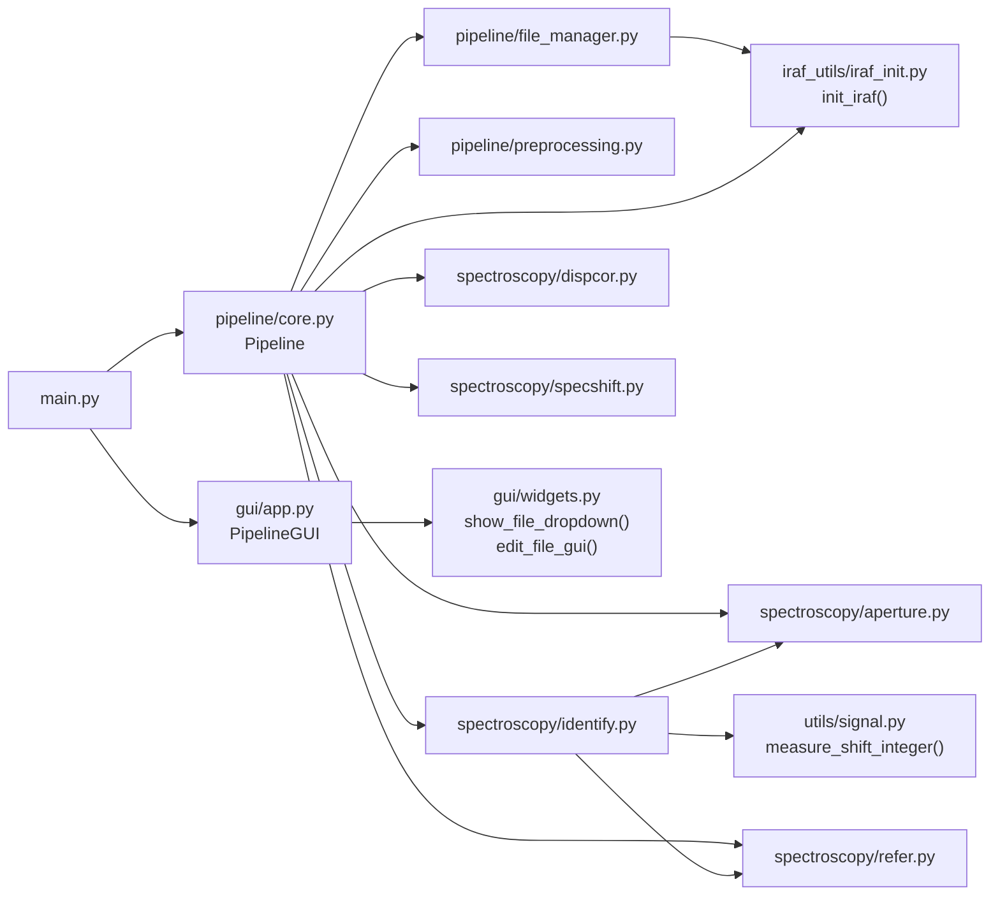

# OMR Spectroscopic Data Reduction Pipeline — Architecture

> **Instrument:** Optomechanical Rotator (OMR) — VBO  
> **Pipeline version:** v2.2  
> **Entry point:** `main.py` → `PipelineGUI` + `Pipeline`

---

## Pipeline Flowchart

The diagram below is segmented into **six horizontal phases**.  
Each node shows the responsible **Python module** and the underlying **IRAF task** (where applicable).

```mermaid
flowchart TD

    %% ═══════════════════════════════════════════════
    %%  PHASE 0 — Startup & IRAF Initialisation
    %% ═══════════════════════════════════════════════
    subgraph P0["Phase 0 · Startup & IRAF Init"]
        direction TB
        A0["🖥️ Launch GUI\n<code>main.py</code>\n<code>gui/app.py :: PipelineGUI</code>"]
        A1["⚙️ Init IRAF Packages\n<code>iraf_utils/iraf_init.py :: init_iraf()</code>\n<i>imutil · noao · imred · ccdred · specred</i>"]
        A0 --> A1
    end

    %% ═══════════════════════════════════════════════
    %%  PHASE 1 — File Ingestion & Directory Setup
    %% ═══════════════════════════════════════════════
    subgraph P1["Phase 1 · File Ingestion & Directory Setup"]
        direction TB
        B0["📂 Select Raw Data Directory\n<code>pipeline/core.py :: select_and_setup_directory()</code>"]
        B1["🔍 Scan FITS Headers by PI / Grating / Centwave\n<code>pipeline/file_manager.py :: scan_files_by_pi()</code>\n<i>Segregates: object · comp · flat · bias · dark</i>"]
        B2["🧹 Auto Sigma-Clip Bias Frames\n<code>pipeline/file_manager.py :: auto_filter_biases()</code>\n<i>MAD-based 3σ rejection on per-frame median & std</i>"]
        B3["⚗️ Combine Master Bias\n<code>pipeline/file_manager.py :: create_masterbias()</code>\n<i>IRAF zerocombine — output: master_bias.fit</i>"]
        B4["👤 User Selects PI\n<code>gui/widgets.py :: show_file_dropdown()</code>"]
        B5["📁 Create PI Folder & Config Sub-folders\n<code>pipeline/file_manager.py :: setup_pi_reduction_dirs()</code>\n<i>Copies obj · comp · flat · bias · dark · master_bias.fit</i>"]
        B6["⚙️ User Selects Grating / Centwave Config\n<code>gui/widgets.py :: show_file_dropdown()</code>"]
        B7["📋 Populate Pipeline File Lists\n<code>pipeline/file_manager.py :: populate_pipeline_lists()</code>\n<i>Fills pipeline.obj · comp · dft · bias · dark</i>"]

        B0 --> B1 --> B2 --> B3 --> B4 --> B5 --> B6 --> B7
    end

    %% ═══════════════════════════════════════════════
    %%  PHASE 2 — Preprocessing
    %% ═══════════════════════════════════════════════
    subgraph P2["Phase 2 · Preprocessing"]
        direction TB
        C0["📊 Display Frame Summary\n<code>pipeline/preprocessing.py :: start_preprocessing()</code>"]
        C1["✂️ Auto-Detect Trim Section\n<code>pipeline/preprocessing.py :: get_auto_trimsec()</code>\n<i>Gradient on Gaussian-smoothed flat spatial profile → TRIMSEC</i>"]
        C2["🔧 Update DISPAXIS = 1\n<code>IRAF: ccdhedit</code>"]
        C3["✂️ Trim All Frames\n<code>pipeline/preprocessing.py :: _run_trim()</code>\n<i>IRAF ccdproc → *_t.fit</i>"]
        C4["➖ Bias Subtraction\n<code>pipeline/preprocessing.py :: _run_bias_subtract()</code>\n<i>IRAF ccdproc zerocor → *_tb.fit</i>"]
        C5["🌑 Dark Frame Subtraction\n<code>pipeline/preprocessing.py :: _run_dark_correction()</code>\n<i>IRAF imarith (exptime-matched) → *_tbd.fit</i>"]
        C6["🌟 Master Flat Combine\n<code>pipeline/preprocessing.py :: _run_flat_fielding()</code>\n<i>IRAF flatcombine → master_flat.fit</i>"]
        C7["📈 Interactive Flat Response\n<code>pipeline/preprocessing.py :: _run_flat_fielding()</code>\n<i>IRAF response — spline3 order 6 → nmaster_flat.fit</i>"]
        C8["➗ Flat-Field Object Frames\n<code>pipeline/preprocessing.py :: _run_flat_fielding()</code>\n<i>IRAF ccdproc flatcor → *_tbdf.fit</i>"]

        C0 --> C1 --> C2 --> C3 --> C4 --> C5 --> C6 --> C7 --> C8
    end

    %% ═══════════════════════════════════════════════
    %%  PHASE 3 — Spectral Extraction (apall)
    %% ═══════════════════════════════════════════════
    subgraph P3["Phase 3 · Spectral Extraction"]
        direction TB
        D0["📸 apall — Object Frames\n<code>spectroscopy/aperture.py :: extract_objects()</code>\n<i>IRAF apall — find/trace/extract (interactive); output: *_tbdf.ms.fits</i>"]
        D1["⏱️ Cache UT Times from Object Headers\n<code>spectroscopy/aperture.py :: parse_ut()</code>"]
        D2["📸 apall — Comparison Lamp Frames\n<code>spectroscopy/aperture.py :: extract_comparisons()</code>\n<i>IRAF apall — nearest-UT object as reference; output: *_tbd.ms.fits</i>"]

        D0 --> D1 --> D2
    end

    %% ═══════════════════════════════════════════════
    %%  PHASE 4 — Frame Shifting, Grouping & Line ID
    %% ═══════════════════════════════════════════════
    subgraph P4["Phase 4 · Frame Shifting, Grouping & Line Identification"]
        direction TB
        E0["👑 User Selects Master Lamp Frame\n<code>spectroscopy/identify.py :: run_identify()</code>\n<code>gui/widgets.py :: show_file_dropdown()</code>"]
        E1["📡 Compute FFT Cross-Correlation Shifts\n<code>spectroscopy/identify.py :: compute_shifts()</code>\n<code>utils/signal.py :: measure_shift_integer()</code>\n<i>Hanning-windowed FFT → integer pixel shift for each comp frame</i>"]
        E2["💾 Write PIXSHIFT to Comp Headers\n<code>spectroscopy/identify.py :: run_identify()</code>\n<i>astropy.io.fits header update (PIXSHIFT keyword)</i>"]
        E3["⏱️ Cache UT Times for All Lamp Frames\n<code>spectroscopy/aperture.py :: parse_ut()</code>"]
        E4["🔗 Assign PIXSHIFT to Object Frames\n<code>spectroscopy/identify.py :: run_identify()</code>\n<i>Nearest-UT lamp → object header PIXSHIFT propagation</i>"]
        E5["🔬 Interactive Line Identification on Master\n<code>spectroscopy/identify.py :: run_identify()</code>\n<i>pyraf subprocess → IRAF identify — arc line atlas</i>"]

        E0 --> E1 --> E2 --> E3 --> E4 --> E5
    end

    %% ═══════════════════════════════════════════════
    %%  PHASE 5 — Reidentification & Dispersion Correction
    %% ═══════════════════════════════════════════════
    subgraph P5["Phase 5 · Reidentification & Dispersion Correction"]
        direction TB
        F0["🏷️ Assign REFSPEC1 to All Frames\n<code>spectroscopy/refer.py :: assign_references()</code>\n<i>FITS header: REFSPEC1 = master_lamp 1.0\nApplied to all obj + non-master comp frames</i>"]
        F1["🌈 Apply Dispersion Correction\n<code>spectroscopy/dispcor.py :: run_dispcor()</code>\n<i>IRAF dispcor reads REFSPEC1 → output: *w.ms.fits</i>"]
        F2["📐 Compute Wavelength Shifts\n<code>spectroscopy/specshift.py :: apply_wavelength_shift()</code>\n<i>Δλ = PIXSHIFT × CD1_1 (Å/px)</i>"]
        F3["🔀 Apply WCS Shift In-Place\n<code>spectroscopy/specshift.py :: apply_wavelength_shift()</code>\n<i>IRAF specshift — zero-interpolation WCS update</i>"]
        F4["📊 Plot Lamp Spectra\n<code>spectroscopy/specshift.py :: plot_lamp_spectra()</code>\n<i>matplotlib overplot → lamp_comparison.png</i>"]
        F5["🔭 Interactive Spectrum Inspect\n<code>pipeline/core.py :: start_plot()</code>\n<i>pyraf subprocess → IRAF splot</i>"]

        F0 --> F1 --> F2 --> F3 --> F4
        F3 --> F5
    end

    %% ═══════════════════════════════════════════════
    %%  Inter-phase connections
    %% ═══════════════════════════════════════════════
    A1 --> B0
    B7 --> C0
    C8 --> D0
    D2 --> E0
    E5 --> F0
```



---

## Phase Summary

| # | Phase | Key Input | Key Output | Core IRAF Tasks |
|---|-------|-----------|-----------|-----------------|
| 0 | **Startup & IRAF Init** | — | IRAF package stack loaded | `imutil`, `noao`, `imred`, `ccdred`, `specred` |
| 1 | **File Ingestion & Directory Setup** | Raw `.fit` files | PI / config sub-folders, `master_bias.fit` | `zerocombine` |
| 2 | **Preprocessing** | Raw frames | `*_tbdf.fit` (flat-fielded object), `*_tbd.fit` (dark-corrected comp) | `ccdproc`, `imarith`, `flatcombine`, `response` |
| 3 | **Spectral Extraction** | 2-D FITS frames | `*.ms.fits` 1-D spectra | `apall` |
| 4 | **Frame Shifting, Grouping & Line ID** | `*.ms.fits` comp frames | `PIXSHIFT` in headers, `database/` solution | `identify` |
| 5 | **Reidentification & Dispersion Correction** | `*.ms.fits` + `PIXSHIFT` + `REFSPEC1` | `*w.ms.fits` wavelength-calibrated spectra | `dispcor`, `specshift`, `splot` |

---

## Module Dependency Map



---

## File Naming Convention (Suffix Trail)

Each preprocessing step appends a letter suffix, making the provenance of any file immediately legible:

```
raw.fit
  └─ *_t.fit          ← Trimmed              (ccdproc / trimsec)
       └─ *_tb.fit    ← Bias-subtracted      (ccdproc / zerocor)
            ├─ *_tbd.fit   ← Dark-corrected Comp (imarith)
            └─ *_tbdf.fit  ← Dark+Flat Obj       (imarith + ccdproc/flatcor)
                 ├─ *_tbd.ms.fits   ← Extracted Comp           (apall)
                 ├─ *_tbdf.ms.fits  ← Extracted Object         (apall)
                 ├─ *_tbdw.ms.fits  ← Dispersion-corrected Comp (dispcor)
                 └─ *_tbdfw.ms.fits ← Dispersion-corrected Obj  (dispcor)
```

> After `specshift`, the WCS of `*w.ms.fits` files is updated **in-place** (no new file is created).

---

## Key Design Decisions

| Decision | Rationale |
|----------|-----------|
| **FFT cross-correlation shift measurement** (`utils/signal.py`) | Hanning-windowed integer-pixel FFT gives a robust, interpolation-free relative shift between lamp frames before any wavelength solution exists. |
| **Nearest-UT time-matching** (aperture, identify, refer) | Associates each lamp/comp frame with the closest-in-time object or master lamp, minimising flexure-induced wavelength error. |
| **`PIXSHIFT` header keyword** | Decouples the shift measurement (Phase 4) from its application (Phase 5), allowing `dispcor` to run in between without losing the measured shifts. |
| **`REFSPEC1` keyword** | Standard IRAF mechanism; all non-master frames point to the master lamp so `dispcor` applies the single identified solution to all frames. |
| **`subprocess` for interactive IRAF tasks** (`response`, `apall` obj, `identify`, `splot`) | Isolates the pyraf graphics context from the Tkinter event loop, preventing GUI lock-ups during interactive IRAF sessions. |
| **Sigma-clipping bias selection** (`auto_filter_biases`) | MAD-based 3σ rejection removes pathological bias frames without manual selection, making the pipeline fully automated up to master-bias creation. |
| **Auto trim-section detection** (`get_auto_trimsec`) | Gradient of the Gaussian-smoothed flat's spatial profile locates slit edges, eliminating the manual TRIMSEC entry step. |
